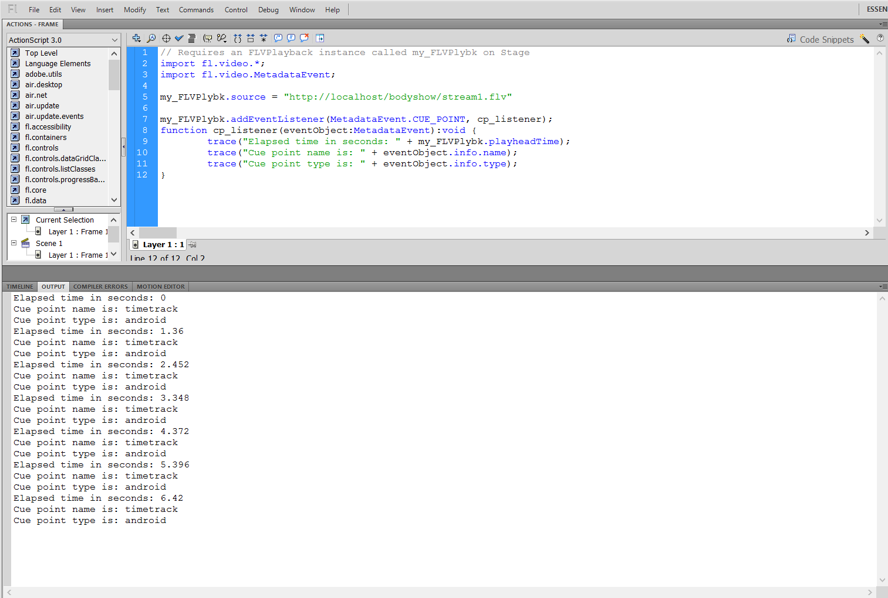

#Published CuePoint Recording


### Recording CuePoints


```Java
Map<String, Object> map = new HashMap<String, Object>();
map.put("time", time);
map.put("name", "timetrack");
map.put("type", "android");
publish.send("onCuePoint", map);
```


### Reading the embedded cuepoint data in flash usign a FLVPlayer component

```Actionscript
import fl.video.*;
import fl.video.MetadataEvent;

my_FLVPlybk.source = "http://localhost/bodyshow/stream1.flv"

my_FLVPlybk.addEventListener(MetadataEvent.CUE_POINT, cp_listener);
function cp_listener(eventObject:MetadataEvent):void {
        trace("Elapsed time in seconds: " + my_FLVPlybk.playheadTime);
        trace("Cue point name is: " + eventObject.info.name);
        trace("Cue point type is: " + eventObject.info.type);
}
```


__ScreenShot : CuePoints In FLVPlayer__


